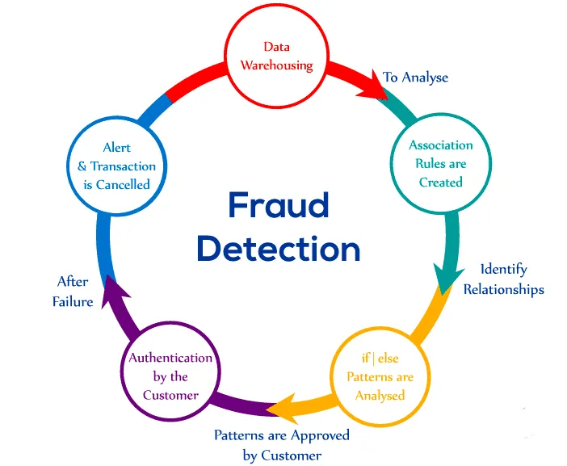

# Data Science Portfolio
---
## Machine learning
### Fraud Detection

Fraud detection is a set of processes and analyses that allow businesses to identify and prevent unauthorized financial activity. This can include fraudulent credit card transactions, identify theft, cyber hacking, insurance scams, and more.

[View in GitHub](https://github.com/rajashree3/Course).

